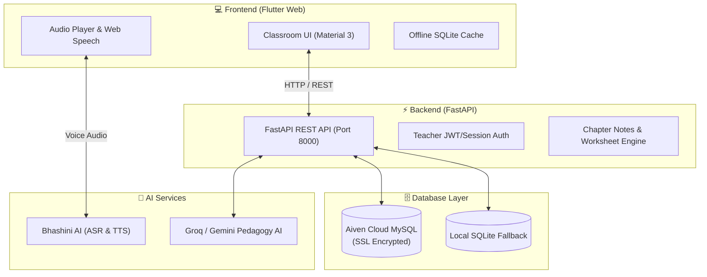

# 🌟 Bhasha Sangi (भाषा संगी)
### *Bridging Textbooks & Tribal Mother Tongues in Primary Classrooms*

[](https://flutter.dev)
[](https://fastapi.tiangolo.com)
[](https://aiven.io)
[](https://bhashini.gov.in)
[]()

---

## 📖 Overview

**Bhasha Sangi** is an AI-powered vernacular educational platform aligned with the **National Education Policy (NEP 2020)**. It enables primary school teachers in tribal and regional areas (specifically Jharkhand, Odisha, and West Bengal) to bridge standard state curriculum textbooks with students' indigenous mother tongues — including **Santali (Ol Chiki)**, **Ho (Warang Chiti)**, and **Mundari**.

---

## 🏛️ System Architecture



---

## ✨ Key Features

1. **🎙️ One-Tap Speak & Translate**:
   * Instant bilingual translation between Hindi/English and indigenous languages with Bhashini Voice AI.
2. **📚 Curriculum Alignment (Classes 1 – 8)**:
   * 140 JCERT & NCERT chapters mapped across Environmental Studies (EVS), Science, English, and Mathematics.
3. **📝 Class 3 AI Chapter Notes & Printable PDFs**:
   * Pre-generated, bilingual chapter study kits complete with cultural context, vocabulary bridges, and classroom activities.
4. **🃏 Daily Learning Flashcards**:
   * 32 interactive cards with Roman phonetics, Ol Chiki script rendering, Hindi translations, and audio pronunciation.
5. **🔐 Teacher Classroom Portal**:
   * Secure teacher login and registration with synchronized classroom profiles.
6. **🌐 Dual-Database Sync (Online / Offline)**:
   * Operates seamlessly online with **Aiven Cloud MySQL** and falls back to **Local SQLite** in rural low-connectivity areas.

---

## 📂 Repository Structure

```text
BhashaSangi/
├── backend/                  # FastAPI Python backend
│   ├── main.py               # API endpoints & route handlers
│   ├── database.py           # Aiven MySQL + SQLite dual-connection manager
│   ├── chapter_notes_service.py # AI chapter study notes generator
│   ├── requirements.txt      # Python dependencies
│   ├── render.yaml           # One-click Render deployment configuration
│   └── .env.example          # Sample environment variables
│
├── frontend/                 # Flutter Web client
│   ├── lib/
│   │   ├── config/           # Theme (Poppins, Noto Sans & Lexend highlights)
│   │   ├── models/           # Data models (Languages, Chapters, Flashcards)
│   │   ├── screens/          # Application views (Home, Lessons, Notes, Login)
│   │   ├── services/         # API, Auth, and Voice audio services
│   │   └── widgets/          # Classroom UI components and navigation
│   └── pubspec.yaml          # Flutter package dependencies
│
├── run_all.bat               # Single-click launcher for Windows
└── README.md                 # Complete project documentation
```

---

## 🚀 Quick Start Guide

### Prerequisites
* **Python 3.10+**
* **Flutter SDK 3.20+**
* **Google Chrome or Microsoft Edge**

### Option 1: One-Click Launch (Windows)
Double-click `run_all.bat` or run:
```powershell
.\run_all.bat
```

### Option 2: Manual Launch

#### 1. Start the Backend:
```powershell
cd backend
python -m pip install -r requirements.txt
python -m uvicorn main:app --host 127.0.0.1 --port 8000 --reload
```
*Backend API Docs will be live at: `http://127.0.0.1:8000/docs`*

#### 2. Start the Frontend:
```powershell
cd frontend
flutter pub get
flutter run -d edge --web-port 3000
```
*Classroom Portal will open automatically at: `http://localhost:3000`*

---

## 🔑 Demo Teacher Credentials

For demonstration and testing purposes:
* **Username**: `sunita`
* **Password**: `password123`
* **Assigned School**: Govt. Primary School, Dumka, Jharkhand

---

## 🌍 Deployment

* **Backend**: Ready to deploy on [Render](https://render.com) using the included `backend/render.yaml`.
* **Frontend**: Build the static web release with `flutter build web --release` and deploy to [Netlify](https://netlify.com), [Vercel](https://vercel.com), or **GitHub Pages**.

---

## 📄 License
This project is licensed under the MIT License - see the LICENSE file for details.
